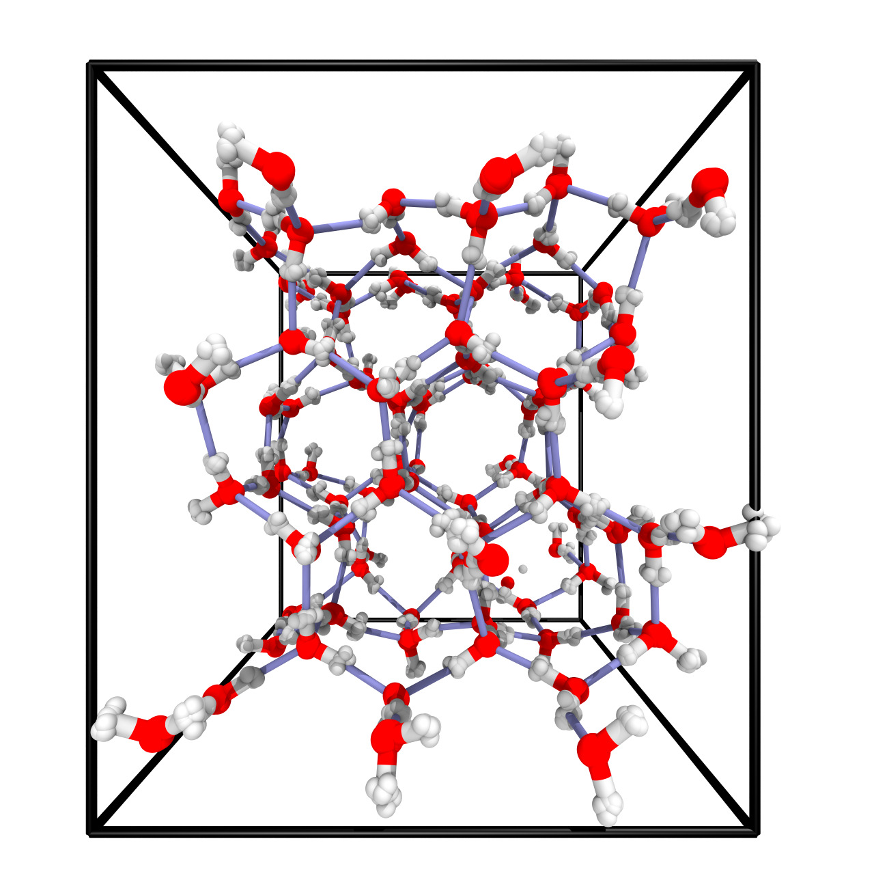

# MPhil in Scientific Computing - University of Cambridge
## Advanced Atomistic Simulation Techniques Course - Practical 2

## Path integral molecular dynamics simulation of ice

### Introduction

### Simulations
#### Before you start

We will run this practical on one of the cerberus clusters that you have access to.
All software required for the completion has been installed there.

Adapt the following ssh command to your needs, please distribute over the three available clusters:\
`ssh -X USER@cerberus1/2/3.lsc.phy.private.cam.ac.uk`

For the rest of the practical work within a directory under `/data/cerberus1/2/3`. For example, if you logged into cerberus2, create a directory under your username:\
`mkdir /data/cerberus2/$USER`

Change to this directory and clone the github repository of this practical:\
`git clone https://github.com/cschran/mphil-aast-practical2.git`

Once you are in the directory, execute the following command to setup the correct system environment:\
`source setup.sh`

### Run PIMD simulation
The directory `01-PIMD-ice` contains the input files for running an PIMD simulation of 96 molecules of water in a periodic box.
We will use the C-NNP model developed in the previous practical for representing our interactions.

Take a look at the input file `pimd.inp`. There are some control parameters that you need to choose yourself.
Based on the timings from the previous practical and assuming trivial parallelisation, estimate how many replicas and simulation steps you can afford within a short 5 Min simulation.

Once you have changed the input, the simulation can be launched with the following command:\
`mpirun -n 8 /data/cerberus1/cs2121/cp2k/exe/Linux-intel-x86_64/cp2k.popt pimd.inp > pimd.out &`

Is the timing as expected?

### Path integral convergence
The path integral formalism is only exact in the limit of infinite number of replicas $P$.
However, luckily observables tend to converge to their quantum mechanical value already at a finite $P$.

Using the input file from step 1, setup a series of simulations with increasing number of replicas in `02-CONVERGENCE`.
Again, make use of your timing estimates from before to choose reasonable values.
The bash script `setup-simulations.sh` will help you, but you will have to set some parameters.

By analysing the average potential energy and radius of gyration as a function of $P$, estimate how many replicas you need for your system at a temperature of 250K.
Note that this convergence is temperature dependent. Do you know why?

### Production run and comparison to classical MD
After having determined a reasonable choice for the number of replicas, setup a longer simulation in `03-PRODUCTION`.
As before, the `setup-simulations.sh` script will help you, but remember to change the parameters.

In order to understand what impact nuclear quantum effects have on the structure of ice, we will also perform a classical simulation $(P=1)$.

By analysing the radial distribution functions of the two simulations, determine which properties are impacted strongest by nuclear quantum effects.
Which of these do you think compares better to experiment?

## Analysis within jupyter-notebook
Juptyer notebook is a web application for creating and sharing computational documents.
It offers a simple, streamlined, document-centric experience and has become a standard tool in the field to perform quick analysis and write code.

You can start a notebook on cerberus and then access it on your local machine.
In the main directory of the repository, execute `jupyter-notebook --no-browser`. This will lock up this session, so it is best to do it in a new terminal.

On your local machine, you can then use ssh to tunnel into the running session (replace XXXX to match the network address shown the by jupyter notebook):\
`ssh -N -y -L localhost:XXXX:localhost:XXX USER@cerberus1/2/3.lsc.phy.private.cam.ac.uk`

Copying the shown network address into your local browser will allow you to access the session:\
`http://localhost:8888/?token=8d186032bbbe095b294789e863b065a546fcc15b68683c99`
